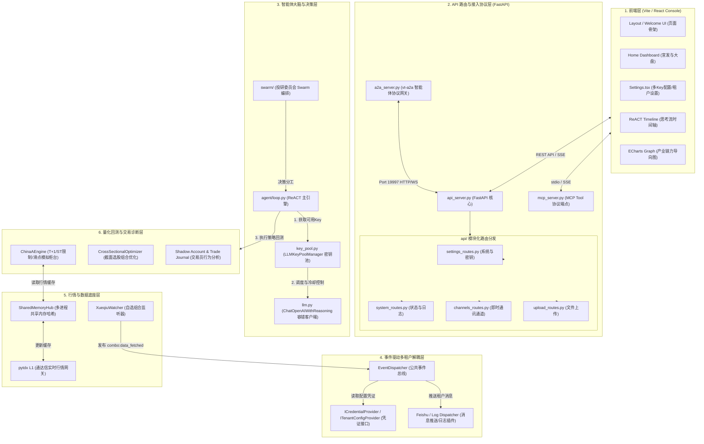

# 🏗️ 潮汐投研 (TideTrading) 系统架构与模块关系图谱

本文档详细描述了 **潮汐投研 (TideTrading)** 系统的整体软件架构、各核心模块（“轮子”）的功能职责、以及各层级之间的数据流向与协作关系。

---

## 1. 🗺️ 整体架构图 (Mermaid Topology)

---

## 2. 🧩 核心模块（“轮子”）功能点详解

### A. 前端交互大屏 (Vite / React)
*   **Settings (密钥与租户面板)**：支持对多租户的管理员 API Key、多 LLM 密钥池（支持分块掩码掩蔽和增删改查）进行交互式配置。
*   **ReACT Timeline (ReACT 思考时间轴)**：将智能体的每一次思考（Thought）、执行工具动作（Action）、观察结果（Observation）和最终决定（Decision）通过流式（SSE）以霓虹色呼吸灯和节点连线的形式进行高密度动态渲染。
*   **ECharts Graph (产业链关系图谱)**：基于 ECharts 的力导向图，对仿真博弈出的个股、概念板块、龙虎榜游资节点进行动态连线绘制，支持 Hover 发光与霓虹高亮。

### B. API 路由与协议网关 (FastAPI)
*   **api_server.py & 模块化路由**：系统的 REST API 主服务，剥离传统臃肿的单文件，通过 `channels_routes.py`、`settings_routes.py`、`system_routes.py` 进行高内聚分类，承载多租户配置交换和动态 Changelog 解析等服务。
*   **mcp_server.py**：实现 Model Context Protocol (MCP) 协议，将潮汐投研底层的行情拉取、量化回测、账户分析等轮子直接打包成标准的 MCP Tools 暴露给 Cursor、Claude Desktop 等主流外部 AI 客户端。
*   **a2a_server.py**：作为 **vt-a2a** 系统服务，监听本地 `19997` 端口，实现智能体对智能体 (Agent-to-Agent) 的高速通信协议，承接并发执行任务和任务终止 (Cancel) 的高并发控制。

### C. 智能体大脑层 (Agent Core)
*   **agent/loop.py**：ReACT 决策主循环。将自然语言 Prompt 编译为可执行的 Step，调度不同的金融工具，完成数据获取、逻辑决策并回写。
*   **Swarm 编排**：由投研委员会 preset (包含 Technical, Fundamentals, News, Risk 四个细分子角色代理) 协同博弈，进行多维度辩论，输出深度研报。
*   **LLMKeyPoolManager**：密钥负载均衡与自动避障冷却核心。支持多渠道、多模型的负载均衡，在遇到大模型 `429` 速率限制或服务异常时自动让 Key 进入冷却状态，并重试漂移至健康密钥，防止同步死锁阻塞主线程。

### D. 事件驱动多租户解耦层 (AOP Event Bus)
*   **EventDispatcher**：本地微型内存事件总线。
*   **XueqiuWatcher (组合监控)**：只专注于行情的拉取。获取数据后，其不再强耦合具体租户目录，而是直接向总线广播 `combo:data_fetched` 事件。
*   **Tenant Dispatcher**：作为事件总线的监听插件，捕获事件后，根据 `ICredentialProvider` 和 `ITenantConfigProvider` 接口获取该事件相关租户的私有配置，独立完成租户日志写入和飞书 Webhook 告警。**实现了控制流与租户存储的安全解耦**。

### E. 量化回测与交易诊断层 (Backtest & Quant)
*   **ChinaAEngine**：专为 A 股打造的 T+1 模拟交易柜台。严格支持 ST股 过滤、涨跌停板交易限制、100股整手交易买卖、过户费与印花税滑动扣除，确保回测结果极度贴近实盘。
*   **CrossSectionalOptimizer**：截面分配优化器。支持在多空组合下限制单一行业暴露最大 30%、最大持仓 Top-30 股票等权重优化算法。
*   **Shadow Account & Trade Journal**：交易员行为分析审计核心。导入券商交割单后，自动分析交易员在心理、持仓期、回撤忍受上的“交易画像”，通过 counterfactual (逆事实推理) 生成“如果按照规则执行”的影子回测对比报告。

### F. 行情与数据底座层 (Market Data)
*   **SharedMemoryHub**：基于共享内存的高速 IPC 共享缓存层。打通主 FastAPI 进程、回测引擎和实时行情网关的数据通路，支持无序列化开销的多进程秒级行情共享。
*   **pytdx Gateway**：基于通达信 L1 实时套接字的行情获取网关，为缓存层不间断注入交易日实时盘口快照。
