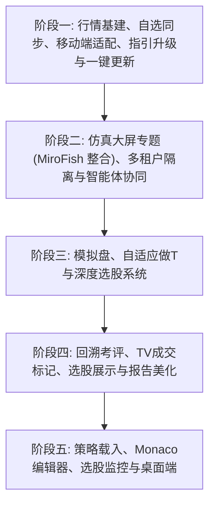

# TideTrading / 潮汐投研 量化工作站 —— 终极产品蓝图与 5 阶段演进路线图 (重构定版)

> [!NOTE]
> 本文件为本地专属的辅助开发资产，已通过项目根目录的 `.gitignore` 规则屏蔽，不上传至 GitHub 远程仓库，确保开发细节的私密性。

---

## 🛡️ 一、 核心设计原则与全局哲学 (Core Principles & Philosophy)

1. **流程自动化优先（Deterministic First）**：
   * **铁律**：能用确定性的流程化脚本、Python 代码、数据库查询或规则引擎自动实现的功能，**坚决不用大模型（LLM）**。大模型与 Agent 的核心优势在于柔性辅助、多模态图像/文本的语义解析、复杂问题的理解，以及在缺乏已开发好的工具代码时的兜底解决。
   * **非滥用逻辑**：对于日常重复性、结构化的执行任务（例如每日固定的行车轨迹循环），应通过纯程序流程逻辑根治。滥用大模型的核心痛点不仅在于高昂 Token 消耗，而在于**时间交互损耗、大模型理解成本增加、语义理解偏差风险以及执行时的准确性/随机性失准**。不控制核心状态，不用 AI 替代高确定性的规则，这是系统“非滥用 AI”的灵魂所在。
2. **大模型定位为语义路由与服务编排器 (LLM as Orchestrator, Not Oracle)**：
   * **铁律**：**严禁直接使用大模型生成股票推荐或预测分析**。
   * **正确定位**：大模型是人机交互的辅助工具。其最大价值是作为**语义路由与原子服务编排器**，理解用户意图，调用我们开发好的确定性原子服务（如选股脚本、通达信实时行情数据网关、技术指标库、同花顺同步网关），将这些客观数据串联并呈现出最准确的结果。
3. **SaaS 云端服务优先，桌面客户端在后 (SaaS First, Desktop Later)**：
   * **当前阶段**：优先打造极简、好用、高并发的多租户云端 SaaS 服务，用户直接通过 Web 网页访问配置即可使用。
   * **远期目标**：在量化底层架构、数据基建高度稳固后，再在阶段五开发类似 VS Code + Cursor 的多窗口、拖拽式桌面客户端。
4. **配置与源码彻底解耦 (Decoupled Configuration)**：
   * **铁律**：所有可变配置（重试次数、缓存时长、Token池、限流等待时间、User-Agent 池、日志参数等）全部抽离至 `.env` 或者是数据库配置，源码中禁止存在任何硬编码配置。
5. **第一性原理（First Principles）**：
   * **研发哲学**：一切开发决策应追溯至事物最本质的源头与因果，严禁“治标不治本”的补丁堆叠。
   * **实例要求**：当发现系统股票数据出现占位符时，不应仅在运行时渲染层去过滤屏蔽（治标），而是必须深入到数据底层（SQLite DB），通过编写静态数据清洗与修复脚本，直接根治源头数据库中的脏数据，以保证系统的长效健康。
6. **奥卡姆剃刀原理（Occam's Razor）**：
   * **设计铁律**：“如无必要，勿增实体”（Entities should not be multiplied beyond necessity）。在系统架构、核心代码和 UI 组件设计中，优先选择最简洁直观的方案，避免过度设计。
   * **实例要求**：保持卡片组件高内聚与轻量化，将样式、框线等管理权统一上卷收拢至父容器的布局树中，严禁给每个子卡片设计复杂的内部独立背景与边框系统，以最少的实体实现最稳定的样式渲染。
7. **架构三层分离（Three-Tier Architectural Separation）**：
   * **铁律**：整个系统划分为三大职责层：
     - **核心工具层 (Core Tooling)**：数据抓取解析、指标计算、模拟交易接口等，聚焦纯净数学与逻辑运算，严禁混入租户/I/O环境上下文。
     - **通用基建层 (Base Infrastructure)**：事件总线、动态调度、凭证加解密库等，独立通用，不绑定具体业务。
     - **租户控制面 (Tenant Control Plane)**：以 AOP/事件订阅/接口注入形式实现的隔离、动态路由与飞书推送等控制逻辑，作为横向切面存在。
   * 开发与重构时必须严守三者边界，严禁混杂。
8. **润物细无声的 AI 赋能与人性防线 (Invisible AI Integration & Anti-Emotion Safeguard)**：
   * **紧密融合与赋能**：非滥用决不等于少用或不用。相反，AI 应作为隐形管道与产品流程深度绑定。AI 的核心价值在于：
     1. **意图与逻辑转化**：理解用户自然语言的策略设想，并精准将其翻译、编译为确定性的量化代码、选股过滤公式或回测配置流，给出更好的优化建议。
     2. **轮子导流与平台教育**：主动引导并指导用户用好、用对平台已经创造出的海量底层工具与基建，深入理解用户的潜在需求并提供即时的场景化答疑。
   * **人性弱点对抗防线 (Psychological Buffer)**：金融交易最大的敌人是人性的弱点（如贪婪、恐慌割肉、FOMO 追高）。作为客观理性的实体，AI 应在风控警报、调仓通知和数据分析中担任用户的“理性缓冲区”，基于历史回测概率与硬性规则指标，协助用户克制情绪化交易，构筑科学的投资心智屏障。

---

## 🔍 二、 现有上游轮子与开源项目复用清单 (Prerequisite Phase)

### 1. ⚙️ 上游 TideTrading 原生轮子复用
*   **量化因子库 (Alpha Zoo)** (`agent/src/factors/zoo/`)：包含了 `academic`、`alpha101`、`gtja191` 及 `qlib158` 因子。直接作为复盘选股的底层数据筛选基础。
*   **研报生成组件 (Report Generator)** (`agent/src/skills/trade-journal/`)：解构该报告的数据格式，作为前端生成并渲染精美图表和 HTML 研报的源数据。
*   **券商连接器抽象 (Trading Connectors)** (`agent/src/trading/connectors/`)：定义了统一的账户资产查询、持仓查询和行情获取接口。后续实现 A股 VirtualBroker 模拟柜台时，必须继承这些原生的 Connector 接口协议规范。

### 2. 🔌 顶级开源项目及参考项目亮点缝合
*   **daily_stock_analysis (DSA)**: 参考其多智能体协同分析、低延迟预警引擎及本地 SQLite 投研数据表设计。将其优秀的代码组织与数据获取逻辑，有机融入到 TideTrading 中。
*   **mootdx** (`mootdx/mootdx`)：作为 L1 TCP 行情获取的第一选择或降级 fallback 行情源。
*   **pytdx** (`rainx/pytdx`)：通达信 L1 TCP 实时行情获取与历史数据下载。
*   **easytrader** (`wnma3/easytrader`)：国内主流零售券商自动下单接口（阶段三实盘交易引入）。
*   **vnpy** (`vnpy/vnpy`)：模拟账户状态（P&L、委托状态机）与多交易网关的管理机制（阶段三模拟盘引入）。
*   **lightweight-charts** (`tradingview/lightweight-charts`)：网页端 K 线图绘制与成交标记（TradeMarker）HUD 的图形交互。
*   **MiroFish** (`666ghj/MiroFish`)：参考其 OASIS 多智能体平行仿真与运行时元编程映射。其帅气的前端多窗口分屏联动运行视图，是整个量化仿真大屏与投委会问答 HUD 的交互源泉（在线 Demo：[MiroFish Console Demo](https://666ghj.github.io/mirofish-demo/console)，本地参考：[_reference/stitching_libraries_ref.md#L6](file://wsl.localhost/Ubuntu-24.04/home/skloxo/aho/openclaw/project/TideTrading/_reference/stitching_libraries_ref.md#L6)）。
*   **algorithm-visualizer** (`algorithm-visualizer/algorithm-visualizer`)：强烈推荐，参考其执行步骤控制和追踪逻辑，将 `ReActTimeline.tsx` 的纯文本日志缝合重构为可视化感知与决策状态链节点（本地参考代码见 [_reference/stitching_libraries_ref.md](file://wsl.localhost/Ubuntu-24.04/home/skloxo/aho/openclaw/project/TideTrading/_reference/stitching_libraries_ref.md#L6)）。
*   **superset** (`apache/superset`)：放弃引入，仅在设计高密度量化大屏网格间距与扁平化细微边框时参考其 UI 排版（本地参考见 [_reference/stitching_libraries_ref.md](file://wsl.localhost/Ubuntu-24.04/home/skloxo/aho/openclaw/project/TideTrading/_reference/stitching_libraries_ref.md#L62)）。
*   **grafana** (`grafana/grafana`)：放弃引入，仅参考其仪表盘锁定 vs 编辑模式对 react-grid-layout 拖放交互状态控制的设计（本地参考见 [_reference/stitching_libraries_ref.md](file://wsl.localhost/Ubuntu-24.04/home/skloxo/aho/openclaw/project/TideTrading/_reference/stitching_libraries_ref.md#L39)）。
*   **seaborn** (`mwaskom/seaborn`)：不作前端依赖，作为 Python 后端统计分析与日报生成工具（本地参考代码见 [_reference/stitching_libraries_ref.md](file://wsl.localhost/Ubuntu-24.04/home/skloxo/aho/openclaw/project/TideTrading/_reference/stitching_libraries_ref.md#L77)）。

---

## 🎨 三、 已完成功能清单 (Completed Backlog)

*   **沙箱隔离**：基于 API Key 哈希动态隔离多租户目录与运行会话。
*   **隐私安全**：公网访问普通租户时，自动隐藏全局大模型和数据源配置。
*   **服务监控**：前端 `/monitor` 看板显示内存、租户列表并集成日志控制台。
*   **i18n汉化**：前端页面 100% 汉化并校准专业金融术语。
*   **配置持久化**：管理员设置存储于持久卷，解决重启后设置复位问题。
*   **雪球调仓**：独立 `/xueqiu` 管理页，实时抓取组合调仓历史并推送飞书。
*   **雪球登录**：提供雪球免密扫码登录自动注入 Token，带过期橙色预警。
*   **微信网关**：个人号微信扫码挂载，支持通过微信发送核心指令交互。
*   **Logo替换**：优化 Logo 资源并全局替换 Favicon 与侧边栏图标。
*   **一键升级与平滑重启 (v0.1.10.cnx.1.2)**：Settings 页面支持容器内版本检测、自动升级与平滑重启。
*   **服务看板与大盘控制一体化 (v0.1.10.cnx.1.3)**：彻底将密钥管理与版本升级模块从设置页剥离，对称并入服务看板 `/monitor`，并增加"复制密钥"气泡按钮进行隐私保护；补齐了手动状态刷新的 Toast 反馈及 Spinner 加载动画；独立日志页面 `/logs` 权限保护与 WARNING 级过滤。
*   **平台级行情共享缓存层 SharedMemoryHub (v0.1.10.cnx.1.4)**：线程安全全局单例缓存，TTL=3秒；A 股交易时间 3 秒高频刷新、非交易时间 60 秒降频；保护通达信 TCP 连接免遭高并发封禁 IP；绑定 FastAPI 生命周期事件；全量单元测试通过（23 passed）。
*   **同花顺自选双向同步 + 秒级盯盘预警 + 收盘自愈 (v0.1.10.cnx.1.5)**：
    *   实现 [ths_sync.py](file://wsl.localhost/Ubuntu-24.04/home/skloxo/aho/openclaw/project/TideTrading/agent/src/market/ths_sync.py)：多租户双向自选同步，交易日 5 分钟 / 非交易日 30 分钟自适应轮询；
    *   实现 [watchlist_monitor.py](file://wsl.localhost/Ubuntu-24.04/home/skloxo/aho/openclaw/project/TideTrading/agent/src/market/watchlist_monitor.py)：秒级自选股实时盯盘，飞书/微信警报推送，5 分钟冷却防刷；
    *   实现 [close_maintenance.py](file://wsl.localhost/Ubuntu-24.04/home/skloxo/aho/openclaw/project/TideTrading/agent/src/market/close_maintenance.py)：每日 15:35 收盘后自动触发 Gap Healing 对账自愈；
    *   实现 [initialize_history_data.py](file://wsl.localhost/Ubuntu-24.04/home/skloxo/aho/openclaw/project/TideTrading/agent/scripts/initialize_history_data.py)（972 行）：历史 K 线一键初始化，集成东财反爬匿名流指纹签名算法绕过。
*   **MootDX 自愈 + 仓库动态追踪脚本 (v0.1.10.cnx.1.6)**：
    *   [preflight.py](file://wsl.localhost/Ubuntu-24.04/home/skloxo/aho/openclaw/project/TideTrading/agent/src/preflight.py) 新增 `_check_mootdx_and_heal`：检测 `~/.mootdx/config.json` 中空 BESTIP 字段时自动删除重生，修复实时行情崩溃问题；
    *   [update_repositories_status.py](file://wsl.localhost/Ubuntu-24.04/home/skloxo/aho/openclaw/project/TideTrading/agent/scripts/update_repositories_status.py)：支持动态远程扫描的参考仓库追踪脚本，按天生成历史日志文件。
*   **多租户并发隔离与多 Key 池负载均衡 (v0.1.10.cnx.1.7)**：
    *   完全取消将租户大模型 API Key 动态注入全局 `os.environ` 的做法，实例化 ChatOpenAIWithReasoning 时物理隔离传参，彻底规避线程间串位泄漏；
    *   实现 `LLMKeyPoolManager` 单例，对多 Key 进行轮换与冷却机制控制，当全部冷却时防抖自愈；
    *   覆写 LangChain 生理周期钩子，捕获 429 报错时静默切换 Key 并自动原地重试。
*   **网格锁定大屏与跨端布局持久化 (v0.1.10.cnx.1.8)**：
    *   使用 `react-grid-layout` 与锁定状态控制（防滑动手势误触），实现卡片可拖拽、可缩放的高灵活性大屏底座；
    *   引入后台 `/settings/dashboard-layout` 接口，将大屏布局持久化至服务端的 `agent/runs/` 文件夹下，实现跨浏览器、多端设备自动同步；
    *   实装了 **ECharts 产业链关系拓扑力导图 (Task 2.5)**、**ReACT 推理时间轴 (Task 2.6)** 与 **智能体质询交互终端 (Task 2.6)** 核心大屏的前端组件与交互骨架（后端真实数据链正处于整合开发中）。

---

## 🗺️ 四、 产品演进路线图 (Roadmap & 5 Phases)



1. **阶段一：高频行情基建、同花顺自选同步、移动端 H5 极简优化、平台使用指引升级与一键更新 (当前阶段)**
   * **大节点目标**：攻克底层行情不稳定的痛点，对接通达信 L1 TCP 秒级行情流；实现与同花顺自选股的双向实时同步；针对手机端提供极简 H5 页面结构优化，确保手机访问触控舒适；重构首页新手地图与智能体典型 Prompts 示例，建立平台专属 Skill 指南，并为正式环境提供一键自动更新。
2. **阶段二：多用户并发隔离、多智能体深度协同、以及双层博弈仿真仪表盘大屏 (重点前调阶段)**
   * **大节点目标**：优先实现并发隔离底座；进而将 **MiroFish 整合工作全部前置**，实现双层科幻仪表盘大屏：
     - **🌍 第一层：全局广播大屏（所有租户可见，平台话题性引流利器）**——一次性计算、全员共享展示；聚焦大盘板块概念题材轮动、产业链舆论热度、龙头个股机会雷达；D3.js 力导向知识图谱实时跳动发光，制造科幻感与话题性，吸引新用户眼球、引爆社群传播。
     - **🔐 第二层：个人私域大屏（权限开放，后续付费卡点）**——以用户自选股/持仓为种子，个人专属博弈推演与关系图谱；按指定用户权限开放，后续营收体系的核心卖点之一。
3. **阶段三：做T网格与 VirtualBroker 模拟盘**
   * **大节点目标**：在稳定的行情与安全的隔离基础上，首先实现 VirtualBroker 模拟柜台与账户委托/持仓状态机；进而开发做T网格策略参数计算引擎，并预留实盘下单接口与一键跟单动作。
   * **跨阶段前置依赖**：阶段一的 Task 1.3（历史行情一键初始化与收盘维护）**必须 100% 完成**。
4. **阶段四：表现回溯评估、TradingView 成交标记 HUD 与研报排版美化**
   * **大节点目标**：自动追踪大模型决策在持有后 5/10/20 天的表现并对胜率打分；在 TradingView K线图上直观画出买(B)卖(S)成交气泡；大幅升级网页端人机交互与研报/日报的 PDF 导出排版。
5. **阶段五：免代码策略载入引擎、在线 Monaco 编辑器与桌面端工作台**
   * **大节点目标**：开发出支持将自然语言/YAML 动态编译为可执行策略的底层载入引擎；在此之上集成 Monaco Editor 提供在线编辑、保存与沙箱回测；接入多模态 VLM 进行深度图表解构，并探索多窗口桌面端。

---

## 🗂️ 五、 各阶段具体任务卡片与严格依赖关系拆解

### 🚩 阶段一具体任务卡片

#### 🎴 [Task 卡片 1.1] 正式环境一键升级与平滑重启系统 (✅ 已完成并封板)
*   **状态**：已发布在 `v0.1.10.cnx.1.2` 封板版本中。

#### 🎴 [Task 卡片 1.2] pytdx 通达信 L1 实时行情网关 (✅ 已完成)
*   **状态**：已完成。

#### 🎴 [Task 卡片 1.7] 平台指引优化、移动端 H5 适配与使用技能书建设 (✅ 已完成)
*   **状态**：已完成。


#### 🎴 [Task 卡片 1.4] 平台级公用数据共享缓存层 (公库机制) (✅ 已完成)
*   **状态**：已完成。

#### 🎴 [Task 卡片 1.3] 历史行情一键初始化与收盘数据自动维护 (✅ 已完成 — v0.1.10.cnx.1.5)
*   **交付内容**：
    - [initialize_history_data.py](file://wsl.localhost/Ubuntu-24.04/home/skloxo/aho/openclaw/project/TideTrading/agent/scripts/initialize_history_data.py)（972 行）：拉取 5-10 年日 K/周 K 历史数据，集成东财反爬指纹签名算法，AkShare 多接口降级链。
    - [close_maintenance.py](file://wsl.localhost/Ubuntu-24.04/home/skloxo/aho/openclaw/project/TideTrading/agent/src/market/close_maintenance.py)（181 行）：每日 15:35 收盘自愈，Gap Healing 对账回填，多源降级链（`stock_bid_ask_em → stock_zh_a_spot → stock_zh_a_hist`）。
    - 东财动态概念板块 slist 融入：收盘维护时同步刷新本地题材成分股，常保最新。
*   **状态**：✅ 已完成并封板于 `v0.1.10.cnx.1.5`。

> [!NOTE]
> **后续优化点（纳入阶段二开发中持续完善）**：实际运行中发现 AkShare 公共接口在行情高峰期偶发限流，可在 v1.6 后续迭代中引入 Tushare 作为第三级 fallback 并添加请求重试指数退避策略（jitter backoff）。

#### 🎴 [Task 卡片 1.5] 同花顺自选股双向实时同步系统 (THS Sync) (✅ 已完成 — v0.1.10.cnx.1.5)
*   **交付内容**：
    - [ths_sync.py](file://wsl.localhost/Ubuntu-24.04/home/skloxo/aho/openclaw/project/TideTrading/agent/src/market/ths_sync.py)（564 行）：`ThsSyncManager` 多租户架构，基于 Cookie 对接同花顺云端自选；交易日 5 分钟 / 非交易日 30 分钟自适应轮询；Cookie 失效时自动降级为本地自选管理。
    - 前端 THS 卡片增强：手动同步按钮 + 状态反馈，自动同步机制面板，Cookie 过期红框警告。
*   **状态**：✅ 已完成并封板于 `v0.1.10.cnx.1.5`。

> [!NOTE]
> **后续优化点**：THS 官方接口版本偶发变更（已发生一次 V1 API 结构变更），建议在 v1.7 中引入接口版本嗅探机制，并增加响应格式校验兜底，防止接口更新导致静默空同步。

#### 🎴 [Task 卡片 1.6] 自选股秒级监控预警与 H5 移动端极简体验优化 (✅ 核心已完成 — v0.1.10.cnx.1.5)
*   **交付内容**：
    - [watchlist_monitor.py](file://wsl.localhost/Ubuntu-24.04/home/skloxo/aho/openclaw/project/TideTrading/agent/src/market/watchlist_monitor.py)（240 行）：单例 `WatchlistMonitorService`，5 秒轮询自选股行情，触发阈值后自动拼装飞书/微信 Webhook 卡片推送，5 分钟预警冷却防刷。
    - 上游 `AbstractIMChannel` 插件式分发架构已预留接口，后续多 IM 通道无需改动核心逻辑。
*   **⬜ 剩余子项（H5 移动端响应式适配）**：移动端媒体查询注入、触控操作自适应优化尚未开始，属于**纯前端优化**，可独立安排在阶段二并行开展，不阻塞任何后续依赖。
*   **状态**：⚡ 核心功能已完成封板，H5 适配为独立待办子项（不阻塞阶段二启动）。

---

### 🚩 阶段二具体任务卡片

#### 🎴 [Task 卡片 2.1] 多用户并发隔离与 LLM Key池管理 (✅ 已完成)
*   **起源与追溯**：
    > ⚠️ **起源说明**：本功能参考并整合了开源项目 TradingAgents-CN 中的大模型统一客户端层。
    > * 统一大模型客户端框架与多厂家适配：[llm_clients/](file://wsl.localhost/Ubuntu-24.04/home/skloxo/aho/openclaw/project/TideTrading/_reference/TradingAgents-CN/tradingagents/llm_clients/)
    > * Google Gemini 专用工具调用与格式兼容网关：[google_tool_handler.py](file://wsl.localhost/Ubuntu-24.04/home/skloxo/aho/openclaw/project/TideTrading/_reference/TradingAgents-CN/tradingagents/agents/utils/google_tool_handler.py)
*   **开发职责**：
    - **多租户数据存储物理/逻辑隔离**：确保每个租户的 `stocks_{tenant_id}.db` 独立运行，彻底隔离数据存储。
    - **大模型 API Key 负载均衡与并发轮换**：支持多 Key 并发轮换与熔断重试逻辑。
    - **统一多厂家大模型客户端与工具网关适配**：复用并整合 `llm_clients`，对国内百炼 Qwen、智谱 GLM、百度千帆以及国外 OpenAI、Gemini 实施统一配置持久化，并对 Google Gemini 的 Function Calling 格式进行自适应注入兼容，确保多智能体工具链高可用。
*   **为什么优先**：底座不牢后续所有选股、Swarm、交易模块全部要返工重构数据库读写逻辑。
*   **状态**：✅ 已完成。已实装进程/协程级 ContextVar 隔离，多 Key 负载均衡、冷却熔断与重试，并完成全套并发及 429 自愈单元测试。


#### 🎴 [Task 卡片 2.2] 选股与复盘日报脚本前端可视化运行 (⬜ 待开发)
*   **阶段内依赖**：Task 2.1（多用户隔离必须先就位，确保脚本在隔离后的租户库中正确读写）。
*   **开发职责**：
    - 将租户已有的选股与复盘日报 Python 脚本搬上前端可视化，一键点击执行。
    - 大模型生成的日报与选股结果在前端进行结构化图文渲染。
*   **状态**：待开始。

#### 🎴 [Task 卡片 2.3] 多智能体深度投研协同管线 (Stock Analysis Swarm) (⬜ 待开发)
*   **阶段内依赖**：Task 2.1（隔离）+ Task 2.2（选股可视化作为决策结果的展示载体）。

> [!NOTE]
> **并行开发说明**：Task 2.3（LangChain/LiteLLM 投研 Swarm）与 Task 2.4（CAMEL-OASIS 博弈仿真）底层技术栈完全独立，仅共享同一个隔离底座（Task 2.1）。两者**可以并行开发**，无需互相等待，可缩短阶段二开发周期近一半。

*   **开发职责**：
    - **多维度子智能体编排**：引入技术面（Technical）、个股基本面（Fundamentals）、消息情报（Intel/News）、财务风控（Risk）子代理。
    - **融入 A 股特化分析师**：引入 `ChinaMarketAnalyst` 中国市场分析师，专长于 A 股涨跌停板、T+1、两融、科创板机制以及国企改革等本土特色政策性题材的分析。
    - **个股量化指标与财务分析自愈**：参考并复用 `market_analyst.py` 进行通达信指标的量化计算，复用 `fundamentals_analyst.py` 进行 A 股财务指标的防错计算，杜绝大模型计算错误。
    - **多层次舆情新闻精筛**：引入基于 `news_analyst.py` 机制的新闻过滤与量化评分评分节点，确保进入决策的数据纯净。
    - **多智能体多轮辩论共识引擎**：实现决策辩论状态流，当技术面、基本面和风控产生决策冲突时，触发 `InvestDebateState` 与 `RiskDebateState` 多轮交叉质询辩论，收敛得出最终的结构化 JSON 决策看板。
*   **参考代码 (daily_stock_analysis / TradingAgents-CN)**:
    - 编排与执行器：[orchestrator.py](file://wsl.localhost/Ubuntu-24.04/home/skloxo/aho/openclaw/project/TideTrading/daily_stock_analysis/src/agent/orchestrator.py) + [executor.py](file://wsl.localhost/Ubuntu-24.04/home/skloxo/aho/openclaw/project/TideTrading/daily_stock_analysis/src/agent/executor.py)
    - 本土化中国市场分析师：[china_market_analyst.py](file://wsl.localhost/Ubuntu-24.04/home/skloxo/aho/openclaw/project/TideTrading/_reference/TradingAgents-CN/tradingagents/agents/analysts/china_market_analyst.py)
    - 个股财务数据防错计算：[fundamentals_analyst.py](file://wsl.localhost/Ubuntu-24.04/home/skloxo/aho/openclaw/project/TideTrading/_reference/TradingAgents-CN/tradingagents/agents/analysts/fundamentals_analyst.py)
    - 技术指标精算与评估：[market_analyst.py](file://wsl.localhost/Ubuntu-24.04/home/skloxo/aho/openclaw/project/TideTrading/_reference/TradingAgents-CN/tradingagents/agents/analysts/market_analyst.py)
    - 智能新闻多层精筛与过滤：[news_analyst.py](file://wsl.localhost/Ubuntu-24.04/home/skloxo/aho/openclaw/project/TideTrading/_reference/TradingAgents-CN/tradingagents/agents/analysts/news_analyst.py)
    - 多轮冲突辩论与决策自适应流转：[conditional_logic.py](file://wsl.localhost/Ubuntu-24.04/home/skloxo/aho/openclaw/project/TideTrading/_reference/TradingAgents-CN/tradingagents/graph/conditional_logic.py)
*   **状态**：待开始。

#### 🎴 [Task 卡片 2.4] 多智能体舆情与交易博弈仿真沙盘 (OASIS 金融仿真) (⬜ 待开发)

> [!IMPORTANT]
> **🏗️ 双层仪表盘架构（2026-07-01 确定）**
>
> | | 🌍 第一层：全局广播大屏 | 🔐 第二层：个人私域大屏 |
> |---|---|---|
> | **可见范围** | 所有普通租户均可访问 | 仅指定权限用户（后续付费开放）|
> | **数据种子** | 全市场涨停板/板块/题材/产业链/舆论热帖 | 用户自选股 + 持仓 + AI 历史会话 |
> | **计算模型** | 服务器常驻 1 个实例，N 个用户共看（直播间模式）**固定开销** | 用户触发后台排队，高级权限优先调度 |
> | **资源压力** | 无论多少用户同时观看，LLM 调用量固定 | 每次推演消耗 ~10-20 次 LLM 调用，须限流保护 |
> | **商业价值** | 平台噱头/话题性引流，制造传播效果 | 付费转化核心卖点，后续营收体系入口 |
> | **Task 2.1 依赖** | ❌ **无需**，可独立于多租户底座先行开发 | ✅ 软依赖（读取用户自选种子数据）|

*   **起源与追溯**：
    > ⚠️ **起源说明**：本功能起源于开源项目 MiroFish。
    > * 后端运行与 IPC 轮询实现：[simulation_runner.py](file://wsl.localhost/Ubuntu-24.04/home/skloxo/aho/openclaw/project/TideTrading/_reference/MiroFish/backend/app/services/simulation_runner.py) + [simulation_ipc.py](file://wsl.localhost/Ubuntu-24.04/home/skloxo/aho/openclaw/project/TideTrading/_reference/MiroFish/backend/app/services/simulation_ipc.py)
    > * 中国人生活作息时间配置：[simulation_config_generator.py#L29-L48](file://wsl.localhost/Ubuntu-24.04/home/skloxo/aho/openclaw/project/TideTrading/_reference/MiroFish/backend/app/services/simulation_config_generator.py#L29-L48)
    > * **A股角色人格画像生成器（捏人核心）**：[oasis_profile_generator.py](file://wsl.localhost/Ubuntu-24.04/home/skloxo/aho/openclaw/project/TideTrading/_reference/MiroFish/backend/app/services/oasis_profile_generator.py) — 需改写为游资/主力/北向资金/价值投资者/短线散户等 A股特色角色矩阵，是整个仿真沙盘的内容灵魂。
    > * 前端实时动作流与步骤面板：[Step3Simulation.vue](file://wsl.localhost/Ubuntu-24.04/home/skloxo/aho/openclaw/project/TideTrading/_reference/MiroFish/frontend/src/components/Step3Simulation.vue)
*   **第一层（全局广播）开发职责**：
    - **全局 OASIS 常驻仿真实例**：服务端常驻 1 个仿真子进程，每日开盘前以全市场涨停板/板块数据与社区热帖作为"现实种子"自动触发推演，盘中每小时更新结论。
    - **自动化「现实种子」注入**：[social_sentiment_service.py](file://wsl.localhost/Ubuntu-24.04/home/skloxo/aho/openclaw/project/TideTrading/daily_stock_analysis/src/services/social_sentiment_service.py) 雪球/股吧舆情直接喂沙盘；配合 [social_media_analyst.py](file://wsl.localhost/Ubuntu-24.04/home/skloxo/aho/openclaw/project/TideTrading/_reference/TradingAgents-CN/tradingagents/agents/analysts/social_media_analyst.py) 形成「采集→情感量化」两段流水线。
    - **A股版角色画像**：游资、主力机构、北向资金、散户、财经博主等特色角色矩阵，对应不同资金量级与行为模式。
    - **A股交易日作息时间模型**：竞价发酵 → 上午集中 → 午间休市舆论 → 下午收盘争夺 → 盘后龙虎榜讨论。
    - **前端直播式 Timeline 组件**：所有访客实时观看同一张仿真时间流（"直播间"模式），只读展示。
*   **第二层（个人私域）开发职责**：
    - **权限控制**：管理员在 Settings 中为指定用户开启「私域仿真」权限；后续付费体系对接后，按订阅等级自动授权。
    - **个人种子数据采集**：读取该租户自选股（Task 1.5）与 AI 历史会话摘要，构建个人化仿真种子。
    - **排队调度引擎**：用户触发后台排队，资源空闲时按优先级调度，防止并发爆发过载服务器。
    - **无 Socket 文件式 IPC 命令网关**：通过 `ipc_commands/` 和 `ipc_responses/` 目录下的 JSON 命令卡片控制个人仿真启停与 Interview 交互。
*   **状态**：待开始。**建议先实现第一层全局广播版本快速上线制造话题，再迭代第二层个人私域版本。**

#### 🎴 [Task 卡片 2.5] 上帝视角实时个股关系网络 (D3.js 动态知识图谱) (⬜ 待开发)

> [!NOTE]
> **双层架构同步适用**：
> - **全局图谱**（所有用户可见）：展示题材→产业链→热门个股的全市场关系宇宙图，节点数据来自全局仿真（Task 2.4 第一层）输出。❌ **无需 Task 2.1**，可提前独立开发，是平台门面级视觉效果。
> - **个人图谱**（权限用户专属）：以用户自选股/持仓为中心节点，辐射产业链关联个股与舆论关系。依赖 Task 2.1（租户隔离）+ Task 2.4 第二层。

*   **起源与追溯**：
    > ⚠️ **起源说明**：本功能起源于开源项目 MiroFish。
    > * 运行时 Pydantic 类动态定义：[graph_builder.py#L219-L292](file://wsl.localhost/Ubuntu-24.04/home/skloxo/aho/openclaw/project/TideTrading/_reference/MiroFish/backend/app/services/graph_builder.py#L219-L292)
    > * 动作序列化陈述句写入：[zep_graph_memory_updater.py](file://wsl.localhost/Ubuntu-24.04/home/skloxo/aho/openclaw/project/TideTrading/_reference/MiroFish/backend/app/services/zep_graph_memory_updater.py)
    > * D3.js 交互式力学大屏：[GraphPanel.vue](file://wsl.localhost/Ubuntu-24.04/home/skloxo/aho/openclaw/project/TideTrading/_reference/MiroFish/frontend/src/components/GraphPanel.vue)
*   **开发职责**：
    - **元编程本体动态类型映射**：根据个股舆情题材，运行时利用 Python 元编程动态创建强类型节点结构，构建个股与题材的实体关系图，并通过本地 SQLite 或 Redis 存储时序动作数据（**注：不引入 Zep Graph Memory 服务**，仅参考其动作序列化写入思路，避免额外部署图数据库带来的架构复杂度）。
    - **时序动作自然语言 Episode 化队列**：将 Agent 点赞、发帖、买入动作序列化为陈述句（如"游资[宁波解放路]买入[贵州茅台]"），异步队列写入本地存储层。
    - **ECharts 力导向图实时大屏（全局版，代替 D3.js）**：前端使用 **ECharts `graph`（力导向图）** 绘制节点拖拽、力导向布局、鼠标 Hover **发光特效**（`shadowBlur`）、缩放、节点详细属性侧栏；全局模式对所有访客只读展示，节点实时跳动更新。ECharts 图表引擎已在项目中统一确认为替代 D3.js/reagraph/visx 的标准选型，与 `D3RelationGraph.tsx` 的重构方向保持一致。
    - **个人快照与标注（私域版）**：权限用户可在全局图谱基础上对自己关心的节点进行书签标记与私有注释，图谱中心自动聚焦至本人持仓节点。

*   **状态**：进行中（前端组件骨架已完成，等待后端真实仿真与 ECharts 接口对接）。

#### 🎴 [Task 卡片 2.6] AI 研报 ReACT 思考时间轴与交互式问答 (ReACT Dashboard)
*   **起源与追溯**：
    > ⚠️ **起源说明**：本功能起源于开源项目 MiroFish。
    > * 后端 ReACT Agent与日志记录器：[report_agent.py#L36-L293](file://wsl.localhost/Ubuntu-24.04/home/skloxo/aho/openclaw/project/TideTrading/_reference/MiroFish/backend/app/services/report_agent.py#L36-L293)
    > * 图谱检索与采访工具箱：[zep_tools.py](file://wsl.localhost/Ubuntu-24.04/home/skloxo/aho/openclaw/project/TideTrading/_reference/MiroFish/backend/app/services/zep_tools.py)
    > * 前端 ReACT 时间轴与正则切片渲染：[Step4Report.vue (L218-L364 Timeline UI, L689-L900 parseInterview Regex)](file://wsl.localhost/Ubuntu-24.04/home/skloxo/aho/openclaw/project/TideTrading/_reference/MiroFish/frontend/src/components/Step4Report.vue)
*   **阶段内依赖（精确化）**：
    - **ReACT 时间轴子功能**：依赖 Task 2.3（Swarm 产生的 SSE 实时日志流）。Task 2.3 未就绪时可先开发日志格式解析与 UI 骨架。
    - **InsightForge 图谱检索子功能**：依赖 Task 2.5（Zep 图谱已有数据落库）。Task 2.5 未就绪时，InsightForge 工具调用无可检索的节点。
    - ⚠️ **两个子功能数据流来源独立（SSE vs. Zep），前端 UI 可并行开发，但最终联调须等 Task 2.3 与 Task 2.5 双双就绪。**
*   **开发职责**：
    - **ReACT 投研报告多轮决策记录**：后端在 `report_agent.py` 运行时，使用专用的 ReportLogger 将 Agent 的 Thought, Tool Call 参数和 Observation 数据实时流式写入 `agent_log.jsonl` 日志，并提供 SSE 推送接口。
    - **多维智能体采访与混合图谱检索工具**：封装 Zep 混合检索工具 `InsightForge` 和 Agent 直接采访 Interview 工具，供大模型在 ReACT 思考过程中自由调用（需 Task 2.5 Zep 图谱就绪）。
    - **前端 ReACT 决策时间轴动效组件**：使用 React 渲染 Agent 思考时间轴，动态呈现“Agent 正在调用 InsightForge 检索龙虎榜...”等活动细节。
    - **前端地毯式 Regex 文本切片引擎**：编写 React Regex 解析引擎，提取 Markdown 大文本中的问答段、引言和多媒体卡片，支持“雪球 / 盘面数据”等多平台数据标签气泡展示。
*   **状态**：进行中（前端时间轴与质询控制台已完成，等待后端 ReportAgent 实装与 Zep 混合检索工具集成）。

#### 🎴 [Task 卡片 2.7] 物理路径、项目代号与系统服务更名无缝迁移 (DevOps 专项) (⬜ 待开发)
*   **开发职责与影响评估 (Impact Assessment)**：
    > ⚠️ **核心影响**：变更 WSL 物理路径会打断与外界系统的多项硬关联，必须按照严格的先后顺序执行，否则会导致系统无法冷启动、生产环境 Pull 代码失效或卷数据丢失。
    - **A. Git 远程关联断开风险**：
      - **现状**：生产环境 `/home/skloxo/aho/tide-trading` 关联了名为 `project` 的 Git 远程仓库，指向开发目录 `/home/skloxo/aho/openclaw/project/Vibe-Trading/.git`。
      - **对策**：重命名后，必须**立刻**在生产目录下执行 `git remote set-url project /home/skloxo/aho/openclaw/project/TideTrading/.git`，防止生产环境 `upgrade.sh` 脚本运行报错。
    - **B. OpenClaw IDE 工作区映射断开**：
      - **现状**：IDE 客户端通过 URL `/Ubuntu-24.04/home/skloxo/aho/openclaw/project/Vibe-Trading` 匹配和读取项目配置。
      - **对策**：修改 `openclaw.json` 与 IDE 映射，在新路径下重新载入工作区，并同步通知用户清理旧的历史工作区缓存。
    - **C. Docker Compose 项目名及服务重组**：
      - **现状**：开发环境的 Compose 项目名为 `vibe-trading`，会在 Docker 中生成 `vibe-trading-dev` 和 `vibe-trading-mcp-dev`。
      - **对策**：在原目录下执行 `docker compose down` 彻底清理旧容器，重命名后在新目录下执行 `docker compose up -d` 重新构建 `tidetrading` 命名空间的开发容器与卷。
    - **D. 硬编码物理路径与链接清理**：
      - 修改 `agent/test_infer.py` 等 Python 测试文件中的 `sys.path` 物理路径。
      - 修改 `agent/scripts/update_repositories_status.py` 输出的 `file://` 超链接基准路径。
      - 替换 `README.md` 与 `README_zh.md` 中所有包含 `Vibe-Trading` 的 `file://` 本地文件跳转链接。
    - **E. 备份与清理旧遗留服务**：
      - 彻底移除 `/home/skloxo/.config/systemd/user/` 下已弃用的 `vibe-trading-api.service` 和 `vibe-trading-mcp.service` 用户服务描述文件，防止引起运维误解。
*   **迁移执行步骤 (Execution Checklist)**：
    - [ ] 1. 在当前开发环境目录执行 `docker compose down` 清理旧容器及网络。
    - [ ] 2. 在 WSL 中执行重命名：`mv Vibe-Trading TideTrading`。
    - [ ] 3. 修改 `agent/test_infer.py`、`agent/scripts/update_repositories_status.py` 中的硬编码路径为 `TideTrading`。
    - [ ] 4. 批量更新 `README.md` 和 `README_zh.md` 中的本地文件超链接。
    - [ ] 5. 更新生产环境 `/home/skloxo/aho/tide-trading` 仓库的 `project` 远程 URL 指向。
    - [ ] 6. 在新物理目录下重新拉起开发环境 Docker 容器并验证热更新。
    - [ ] 7. 彻底清除旧 systemd 废弃服务配置。
*   **状态**：待开始。

#### 🎴 [Task 卡片 2.8] 多租户架构彻底解耦与事件驱动重构 (Tenant Decoupling - AOP 专项) (⬜ 待开发)
*   **阶段内依赖**：Task 2.1（隔离底座）。
*   **开发哲学与目标**：贯彻“核心工具与租户控制面彻底分离”的哲学。剥离核心抓取与分析模块中所有的租户目录和环境变量上下文。
*   **开发职责**：
    - **抽象凭证与配置接口**：定义 `ICredentialProvider`（凭证提供器）与 `ITenantConfigProvider`（租户配置提供器）的标准抽象基类。
    - **重构核心抓取模块 (XueqiuWatcher)**：彻底剔除 `xueqiu_watcher.py` 中导入 `active_tenant_var` 以及对租户文件夹进行读写的硬编码行为。watcher 改为从配置提供者获取 Cookie，并在拉取到新数据后仅向公共事件总线（Event Bus）广播发布 `combo:data_fetched` 事件。
    - **构建多租户控制中间件插件 (Tenant Dispatcher)**：在独立路径下（如 `agent/src/multitenancy/`）实现多租户事件分发器，订阅核心事件总线。监听到新行情后，自动查找关联监控该组合的租户、写租户私有目录日志、推送各自飞书 Webhook。
    - **编写 Mock 单元测试**：使用 Mock 凭证提供者进行 watcher 的无 I/O 高速自测，实现 100% 覆盖率。
*   **状态**：待开始（v1.8.0 核心任务）。

#### 🎴 [Task 卡片 2.9] 上游主线主干仓库合并与模块化路由对齐 (Upstream Merge) (⬜ 待开发)
*   **阶段内依赖**：Task 2.8（必须先完成租户解耦，否则上游模块化拆分将与我们混合的代码发生不可逆的合并灾难）。
*   **开发职责**：
    - **合并 upstream/main 分支**：将上游 `ref-upstream/main` 历史合并进本地，解决由于 API 拆分引入的所有路由变更冲突。
    - **路由拆分与对齐**：配合上游拆分后的新模块架构，将我们定制的管理员 Key 管理、租户管理、更新控制 API 手动迁移部署至 `src/api/settings_routes.py`、`src/api/system_routes.py` 等对应的新增路由文件中。
    - **A股本土化清理**：在合并完成后重新清理上游带入的境外市场（美股/加密）相关依赖和冗余逻辑，保护系统高内聚。
    - **前端依赖与包资源整合**：解决 npm 依赖冲突，校对 `Layout.tsx` 页面头部及页脚的 `TideTrading` 品牌版本信息，保证双环境一键编译与启动正常。
#### 🎴 [Task 卡片 2.10] 宣发窗口一源化自动解析与动态渲染 (Changelog Automation) (⬜ 待开发)
*   **开发哲学与目标**：遵循 DRY (Don't Repeat Yourself) 原则，消除更新日志在 README 与服务首页 Home.tsx 之间的重复维护工作。
*   **开发职责**：
    - **开发后端 Markdown 解析器**：在 `api_server.py` 中实现更新日志解析模块。该模块读取 `README.md` (或 `README_zh.md`，基于当前用户的语言配置)，通过正则提取 `## 📰 最新动态` 或 `## 📰 News` 段落，将前 10 条 Z 级更新项结构化解析为 JSON 格式。
    - **提供公共 API 接口**：暴露不限权的公共端点 `GET /api/system/changelog`，支持通过 `lang=zh/en` 参数或请求头返回对应的多语种最新动态。
    - **前端动态请求与渲染**：修改 `Home.tsx`，在页面加载时请求该 API 接口进行动态渲染；同时在前端保留本地 fallback 静态数据，防止离线或接口异常时出现空白。
    - **简化发版规范**：更新 `AGENTS.md`，发版时仅需编辑 `README.md` 与 `README_zh.md`，不再需要手动编辑修改 `Home.tsx`，实现一源化宣发更新。
*   **状态**：待开始（v1.8.0 核心任务）。

#### 🎴 [Task 卡片 2.11] A2A 协议服务并发与取消控制优化 (⬜ 待开发)
*   **开发职责**：
    - **非阻塞 Subprocess 改造**：将 `a2a_server.py` 中 `VTAgentExecutor.execute` 对 CLI 调用的同步阻塞 `subprocess.run` 彻底替换为 `asyncio.create_subprocess_exec`，防止耗时最长 180s 的命令行处理导致主事件循环卡死，彻底解决 A2A 期间心跳和其它并发请求的挂起问题。
    - **取消支持与资源回收**：维护一个活跃的任务 ID 与进程实例映射表（`self._running_processes`），在 `cancel()` 方法中捕获客户端取消信号，调用 `process.kill()` 或 `process.terminate()` 强制切断正在后台运行的 CLI 进程，杜绝僵尸进程占用资源。
*   **状态**：待开始。

#### 🎴 [Task 卡片 2.12] 追踪看板 Git 远程配置纠偏与对账诊断 (⬜ 待开发)
*   **开发职责**：
    - **自适应 Git 追踪源解析**：重构 `update_repositories_status.py` 脚本，自适应兼容检测 `ref-upstream` 与 `upstream` 远程命名，不再写死上游名称。
    - **消除对账状态生成报错**：彻底消除由于找不到 `upstream` 导致 `git rev-list` 崩溃并输出 `Error: Command ... status 128` 的对账单脏数据问题，自动校验远程分支可达性，防抖并优雅降级。
*   **状态**：待开始。

#### 🎴 [Task 卡片 2.13] 遗留架构隐藏路径收拢与多环境兼容 (⬜ 待开发)
*   **开发职责**：
    - **隐藏配置路径一源化收拢**：将代码中散落的所有包含旧名称 `.vibe-trading` 与 `.vibe-trading-cnx` 的物理路径常量，统一迁移收拢到 `src/config/paths.py` 的平台底层，作为通用基建管理。
    - **双向迁移兼容逻辑**：在程序初始化时增加检测：如果宿主机或容器内存在旧有的 `.vibe-trading`，则自动进行静默迁移或建立软链接（symlink），确保老用户配置与自选数据无缝过渡。
    - **容器 vs WSL 宿主机路径自适应**：清理 `repair_local_db_names.py` 与数据导入脚本中硬编码的 `/home/vibe` 或 `/home/skloxo` 绝对路径，利用 `Path.home()` 动态自适应。
*   **状态**：待开始。

#### 🎴 [Task 卡片 2.14] 部署自动化服务联动同步与文档校准 (⬜ 待开发)
*   **开发职责**：
    - **主机 systemd 关联更新**：在 `upgrade.sh` 升级流程的末尾追加 `systemctl --user restart vt-a2a.service` 命令，使拉取代码并重构容器镜像后，宿主机端的 A2A 协议服务自动跟随最新代码热重启。
    - **历史文档与引导路径对齐**：校对并重构 `A2A_ONBOARD.md` 以及根目录下 `update.sh` 中的 legacy `vibe-trading` 路径引用，整体切换为统一的更名后真实服务路径（`tide-trading`）。
*   **状态**：待开始。


---

### 🚩 阶段三具体任务卡片

> [!IMPORTANT]
> **跨阶段前置依赖**：阶段一的 **Task 1.3（历史行情一键初始化与收盘维护）必须 100% 完成**。模拟盘的日终结算需要读取日 K 线数据计算资金曲线与盈亏统计，网格做T需要历史波动率和压力支撑位。

#### 🎴 [Task 卡片 3.1] VirtualBroker 模拟柜台与账户状态机
*   **跨阶段依赖**：Task 1.3（历史 K 线数据库必须完整，日终结算需读取日 K 计算资金曲线）。
*   **参考代码 (daily_stock_analysis / vnpy) ── 复用现成轮子，禁止重复造**:
    - 组合持仓管理与盈亏统计：[portfolio_service.py](file://wsl.localhost/Ubuntu-24.04/home/skloxo/aho/openclaw/project/TideTrading/daily_stock_analysis/src/services/portfolio_service.py)（已实现完整的持仓追踪与盈亏统计，**主导实现**）
    - 风险度量引擎（VaR / 最大回撤 / 夏普比率）：[portfolio_risk_service.py](file://wsl.localhost/Ubuntu-24.04/home/skloxo/aho/openclaw/project/TideTrading/daily_stock_analysis/src/services/portfolio_risk_service.py)（可直接复用，无需重写）
    - **vnpy 委托状态机（仅作设计参考，不直接集成）**：vnpy 的 P&L 核算与多状态委托（待报 / 已报 / 已成 / 部成 / 撤单）流转机制，作为我们自研 VirtualBroker 状态机设计的架构参考，实际不引入 vnpy 依赖，由 DSA `portfolio_service.py` 主导实现。
*   **开发职责**：
    - 设计模拟盘账户，支持现金、持仓、订单状态机（待报、已报、已成、撤单）。
    - 复用 DSA 的 `portfolio_service.py` 接口规范，接入持仓盈亏计算与账户资金曲线统计。
    - 复用 DSA 的 `portfolio_risk_service.py`，为模拟盘提供 VaR、夏普比率等量化风险评估指标展示。
*   **状态**：待开始。

#### 🎴 [Task 卡片 3.2] 盘前做T网格策略参数自动计算与推荐 (⬜ 待开发)
*   **阶段内依赖**：Task 3.1（模拟柜台提供账户与持仓上下文）。
*   **跨阶段依赖**：Task 1.3（波动率与压力支撑位计算依赖历史 K 线数据库）。
*   **开发职责**：
    - 根据波动率与压力支撑位，盘前自动生成网格做T的买入/卖出价格矩阵。
    - 智能体盘前向用户推送今日做T建议。
*   **状态**：待开始。

#### 🎴 [Task 卡片 3.3] 模拟盘一键跟单与实盘下单接口预留 (⬜ 待开发)
*   **阶段内依赖**：Task 3.1（模拟柜台）+ Task 3.2（网格策略提供跟单信号源）。
*   **开发职责**：
    - 用户在前端可一键跟随大模型做出的买入/卖出决策进行模拟交易。
    - 预留 easytrader 实盘下单接口抽象。
*   **状态**：待开始。

#### 🎴 [Task 卡片 3.4] 深度学习选股数据准备与公用因子对接 (⬜ 待开发)
*   **阶段内依赖**：Task 1.3（获取完整历史K线及基本面数据）。
*   **开发职责**：
    - 构建 `TideDataLoader`，通过 `agent/src/factors/registry.py` 的 `Registry` 动态计算 `zoo/qlib158/` 的 158 个经典量价因子，避免重复手写。
    - 对基本面、量价与资金流数据实施前向填充和滚动截面标准化。
    - 实现 A股 停牌、ST股与上市不足20日等特殊交易标记。
    - 实现基于日内未来5日超额收益的动态分位数（30:40:30）标签生成系统。
*   **设计参照与反向链接**：[TideTrading-深度学习选股方案-最终版.md#L247](file://wsl.localhost/Ubuntu-24.04/home/skloxo/aho/openclaw/project/TideTrading/.agents/TideTrading-深度学习选股方案-最终版.md#L247) (包含数据对齐、缺失值、截面归一化等具体规范)
*   **状态**：待开始。

#### 🎴 [Task 卡片 3.5] Walk-Forward 多模型训练与排序学习 (ListMLE) 验证管线 (⬜ 待开发)
*   **阶段内依赖**：Task 3.4（选股特征与标签就绪）。
*   **开发职责**：
    - 搭建 3 个月窗口期、16 轮的 Walk-Forward 时间滑动重训练验证管线。
    - 构建 Fama-French 线性因子模型（Ridge 截面回归）作为 Baseline 1。
    - 构建 LightGBM 树模型（滑窗序列展平）作为 Baseline 2。
    - 实现基于 PyTorch 的 1D-CNN（适配 ListMLE 排序学习损失函数）以及 TFT 时序注意力模型（配合 Quantile 损失）做横向性能大比拼，记录各模型在不同市场状态（牛/熊/震荡）下的 IC、ICIR 及超额收益。
*   **设计参照与反向链接**：[TideTrading-深度学习选股方案-最终版.md#L839](file://wsl.localhost/Ubuntu-24.04/home/skloxo/aho/openclaw/project/TideTrading/.agents/TideTrading-深度学习选股方案-最终版.md#L839) (Ridge/LGBM/TFT/CNN代码实现) & [L1324](file://wsl.localhost/Ubuntu-24.04/home/skloxo/aho/openclaw/project/TideTrading/.agents/TideTrading-深度学习选股方案-最终版.md#L1324) (Walk-Forward验证细节)
*   **状态**：待开始。

#### 🎴 [Task 卡片 3.6] 截面选股优化器插件与 A股 ChinaAEngine 串联回测 (⬜ 待开发)
*   **阶段内依赖**：Task 3.5（模型预测得分就绪）+ Task 3.1（模拟柜台/账户底座）。
*   **开发职责**：
    - 在 `agent/backtest/optimizers/` 编写 `CrossSectionalOptimizer`，实现等权 Top-30 及单行业持仓占比上限 30% 约束。
    - 配置并调用系统原生的 `ChinaAEngine`（[china_a.py](file://wsl.localhost/Ubuntu-24.04/home/skloxo/aho/openclaw/project/TideTrading/agent/backtest/engines/china_a.py)），模拟 T+1、涨跌停买卖限制、100股整手交易、各项手续费与滑点，直接通过系统的 `runner.py` 进行串联回测。
    - 生成信息比率（IR）、年化超额收益、换手率及交易成本占比等标准化回测报告。
*   **状态**：待开始。

---

### 🚩 阶段四具体任务卡片

#### 🎴 [Task 卡片 4.1] 智能决策表现回溯与胜率考评系统
*   **为什么优先**：是 K 线成交标记和研报排版所需的数据源头，必须先有回溯数据才能画成交气泡和渲染考评图表。
*   **跨阶段依赖（精确化）**：
    - **Task 1.3**（历史 K 线数据库）：追踪推荐股票 5/10/20 交易日实际涨跌，必须读取历史行情。
    - **Task 3.1**（VirtualBroker 模拟成交记录）：精确计算“模拟交易买入/卖出”维度的交易胜率，需依赖 Task 3.1 产生的模拟成交价格与时间戳记录。若 Task 3.1 未就绪，可先做“文字推荐理论涨跌”追踪，精确交易胜率待 3.1 完成后补全。
*   **开发职责**：
    - **个股推荐表现跟踪**：自动追踪大模型推荐股票后第 5、10、20 个交易日的实际涨跌表现。
    - **模拟交易精确胜率计算与考评**：从 Task 3.1 模拟成交记录中读取买卖价格，精确计算交易胜率并可视化打分。
    - **局势向量记忆落库 (DSA / TradingAgents-CN 缝合)**：引入基于 ChromaDB 的金融多维场景记忆库，将回溯考评产生的经验与教训自动打标归档，分类存储于牛市记忆（`bull_memory`）和熊市记忆（`bear_memory`）中，确保多智能体在未来面临相似盘面时能自动召回该反思结果。
*   **参考代码 (daily_stock_analysis / TradingAgents-CN)**:
    - 回测服务：[backtest_service.py](file://wsl.localhost/Ubuntu-24.04/home/skloxo/aho/openclaw/project/TideTrading/daily_stock_analysis/src/services/backtest_service.py)
    - 决策信号跟踪：[decision_signal_service.py](file://wsl.localhost/Ubuntu-24.04/home/skloxo/aho/openclaw/project/TideTrading/daily_stock_analysis/src/services/decision_signal_service.py)
    - 多维度金融情境向量记忆库：[memory.py](file://wsl.localhost/Ubuntu-24.04/home/skloxo/aho/openclaw/project/TideTrading/_reference/TradingAgents-CN/tradingagents/agents/utils/memory.py)
*   **状态**：待开始。

#### 🎴 [Task 卡片 4.2] TradingView K线图成交标记 (TradeMarker) HUD (⬜ 待开发)
*   **阶段内依赖**：Task 4.1（必须先有回溯的成交记录数据，才能在 K 线图上画标记）。
*   **开发职责**：
    - 在 K 线图上直观标出模拟交易的买入 (B) 和卖出 (S) 气泡。
*   **状态**：待开始。

#### 🎴 [Task 卡片 4.3] AI 研报与日报排版渲染美化 (⬜ 待开发)
*   **阶段内依赖**：Task 4.1（考评数据用于研报中的胜率图表嵌入）。
*   **开发职责**：
    - 大幅升级研报的排版样式，支持精美的图表嵌入与 PDF/HTML 一键导出。
*   **状态**：待开始。

#### 🎴 [Task 卡片 4.4] 选股服务 FastAPI 挂载、MCP 选股工具扩展与前端展示大屏 (⬜ 待开发)
*   **阶段内依赖**：Task 3.6（回测引擎与选股信号就绪）。
*   **开发职责**：
    - 在 `agent/api_server.py` 中挂载选股接口 `/api/v1/dl-ranking/`。
    - 在 `agent/mcp_server.py` 中注册 `get_dl_stock_ranking` 等 MCP 工具。
    - 在前端 React 页面中新增 `DeepLearningRanking.tsx` 页面，渲染回测资金曲线与每日推荐的 Top-30 股票列表及持仓调整明细。
*   **设计参照与反向链接**：[TideTrading-深度学习选股方案-最终版.md#L2169](file://wsl.localhost/Ubuntu-24.04/home/skloxo/aho/openclaw/project/TideTrading/.agents/TideTrading-深度学习选股方案-最终版.md#L2169) (FastAPI路由注册、MCP工具扩展与独立Python包结构)
*   **状态**：待开始。

---

### 🚩 阶段五具体任务卡片

#### 🎴 [Task 卡片 5.1] 免代码自然语言/YAML 策略因子动态载入 (⬜ 待开发)
*   **为什么优先**：是在线编辑器的底层执行引擎。先有执行引擎，编辑器写出的策略才能被系统动态加载执行。
*   **开发职责**：
    - 支持将自然语言定义的策略编译为 YAML 结构并作为技能动态注入大模型。
*   **参考代码 (daily_stock_analysis)**:
    - 策略目录：[strategies/](file://wsl.localhost/Ubuntu-24.04/home/skloxo/aho/openclaw/project/TideTrading/daily_stock_analysis/strategies) 目录
*   **状态**：待开始。

#### 🎴 [Task 卡片 5.2] 在线 Monaco 策略/因子编辑器与沙箱编译 (⬜ 待开发)
*   **阶段内依赖**：Task 5.1（YAML 策略载入引擎必须就位，编辑器保存的策略才能被执行）。
*   **开发职责**：
    - 集成 Monaco Editor，支持 Python 策略代码的在线编辑、语法高亮与保存。
    - 提供安全的运行沙箱，供用户回测自定义因子。
*   **状态**：待开始。

#### 🎴 [Task 卡片 5.3] 多模态视觉（VLM）图表与 PDF 研报深度解构 (⬜ 待开发)
*   **开发职责**：
    - 利用 VLM 视觉大模型直接分析 K 线图走势和 PDF 格式的券商研报图表。
*   **状态**：待开始。

#### 🎴 [Task 卡片 5.4] 选股模型健康度及因子拥挤度实时监控与自适应重训练 (⬜ 待开发)
*   **阶段内依赖**：Task 4.4（选股API及前端展示就绪）。
*   **开发职责**：
    - 实现 `ModelMonitor` 并接入 API 路由，实时跟踪日频 IC、ICIR 以及连续负 IC 等指标。
    - 引入因子拥挤度监控，自动发现过载因子并对其实施动态降权或临时屏蔽。
    - 实现模型重训练策略：在健康状态降为 "critical"、面临重大事件（大盘波动超 5%）或距上次训练满 30 天时，自动触发重训练流水线。
*   **设计参照与反向链接**：[TideTrading-深度学习选股方案-最终版.md#L1998](file://wsl.localhost/Ubuntu-24.04/home/skloxo/aho/openclaw/project/TideTrading/.agents/TideTrading-深度学习选股方案-最终版.md#L1998) (ModelMonitor监控系统与因子拥挤度检查实现)
*   **状态**：待开始。

---

## 🏆 全局开发依赖链路与最优串行顺序

为了防范"空中楼阁"式的无底层数据支持开发，系统采用以下串行路线：

### 阶段一完成状态总览（截至 v0.1.10.cnx.1.6）

```
✅ Task 1.1 — 正式环境一键升级与平滑重启系统           (v1.2 封板)
✅ Task 1.2 — pytdx 通达信 L1 实时行情网关             (v1.2 封板)
✅ Task 1.4 — 平台级公用数据共享缓存层 (SharedMemoryHub)(v1.4 封板)
✅ Task 1.7 — 平台指引优化与移动端 H5 适配              (v1.4 封板)
✅ Task 1.3 — 历史行情一键初始化与收盘数据自动维护       (v1.5 封板)
✅ Task 1.5 — 同花顺自选股双向实时同步系统               (v1.5 封板)
⚡ Task 1.6 — 自选股秒级监控预警 (核心已完成 v1.5)       H5 适配子项待办
```

> [!IMPORTANT]
> **阶段一核心已清完，阶段二现在可以正式启动！**
> Task 1.6 遗留的 H5 移动端适配属纯前端独立子项，**不阻塞阶段二任何任务的开发启动**。
> 建议在阶段二启动后，将 H5 适配列为阶段二并行进行的「前端专项卡片 2.0」。

### 阶段二至阶段五开发依赖流向图（修正版：明确并行关系）
```
【阶段二底座与更名迁移】  ← 🟢 现在可以启动！(阶段一核心已全清)
Task 2.1 (多用户隔离/Key池) ──► Task 2.2 (选股可视化) ──►┬── Task 2.3 (Swarm投研协同) ──────────────────────► Task 2.6 (ReACT时间轴)
                                                        │                                                         ▲
                                                        ├── Task 2.4 (OASIS博弈仿真) ──► Task 2.5 (D3.js图谱) ───┘
                                                        │
                                                        └──► Task 2.7 (物理更名与服务迁移)

★ 并行关系说明:
  - Task 2.3、Task 2.4 与 Task 2.7 均只依赖 Task 2.1，它们相互独立，可并行开发。
  - Task 2.5 与 Task 2.6 前端大屏同屏展示，但数据流独立，可并行开发
  - Task 2.6 依赖 Task 2.3（需 Swarm 产生 ReACT 日志）
  - Task 2.5 依赖 Task 2.4（需 OASIS 产生时序动作数据）
  - H5 移动端适配（原 Task 1.6 子项）可在 Task 2.2 并行开展，纯前端无后端依赖

【阶段三交易与选股】 ⬆ 跨阶段依赖: Task 1.3 ✅ 已完成（历史K线与基本面数据就绪）
Task 3.1 (VirtualBroker，复用DSA) ──► Task 3.2 (网格做T计算) ──► Task 3.3 (一键跟单机制)
                                        │
                                        ▼
Task 3.4 (选股数据准备，对接公用因子) ──► Task 3.5 (Walk-Forward 训练) ──► Task 3.6 (优化器插件与ChinaA回测)
                                                                                  │
                                                                                  ▼
【阶段四回溯与接口】
Task 4.1 (智能决策表现回溯) ──► Task 4.2 (TV K线成交标记) ──► Task 4.3 (AI研报美化)
                                                                                  ▲
Task 4.4 (选股API、MCP工具与前端看板) ─────────────────────────────────────────────┘
                                        │
                                        ▼
【阶段五策略与监控】
Task 5.1 (YAML策略载入) ──────► Task 5.2 (Monaco编辑器) ──────► Task 5.3 (VLM研报解构)
                                                                                  ▲
Task 5.4 (选股模型监控与自愈训练) ────────────────────────────────────────────────┘
```


## 💡 六、 参考项目近期更新借鉴与缝合清单 (Backlog of Seeding Ideas)

> [!NOTE]
> 本章节由 Antigravity 在每次执行参考项目追踪扫描后自动追加/更新。最后更新时间：**2026-07-01**。
> 追踪脚本：[update_repositories_status.py](file://wsl.localhost/Ubuntu-24.04/home/skloxo/aho/openclaw/project/TideTrading/agent/scripts/update_repositories_status.py)

根据对我们当前追踪的 8 个参考项目及上游官方库的最新 Commit 变更的梳理，我们提取出以下 5 个极具借鉴价值的功能点，并已与 TideTrading / 潮汐投研 的 5 阶段演进路线图进行了深度融合与挂载：

---

### 1. A 股特色「打板（涨停板）与连板」量化追踪
*   **解构提取自**：`A Stock Data (参考项目)`
*   **关联 Commit 与代码**：
    *   Commit: [`bcda4054`](https://github.com/search?q=bcda4054&type=commits) (`feat: 新增打板/ETF期权/舆情互动三层 (v3.3.0 · #13 #23 #15)`)
    *   源端实现：`a_stock_data/limit_up_board.py` （打板/连板天数/涨停开板原因分类逻辑）
*   **功能描述**：
    *   每日盘中/盘后实时追踪涨停个股，自动归类连板天数（例如 2 连板、3 连板）、首次涨停时间、封单资金量及炸板次数。
    *   提供以“打板/连板高度”为维度的市场超短线情绪风向标。
*   **路线图整合与挂载点**：
    *   **挂载点**：**阶段二 Task 2.3 (多智能体深度投研协同管线)**
    *   **整合设计**：在 Swarm 中设计一个专门的 `LimitUpBoardAnalyst` 智能体。在进行个股题材评估时，自动调用该工具，结合大单资金流判断个股是否属于连板龙头，从而规避追高风险或捕捉短线强势龙头机会。

---

### 2. A 股 ETF 期权异动与隐含波动率 (IV) 监控
*   **解构提取自**：`A Stock Data (参考项目)`
*   **关联 Commit 与代码**：
    *   Commit: [`bcda4054`](https://github.com/search?q=bcda4054&type=commits) (`feat: 新增打板/ETF期权/舆情互动三层`)
    *   源端实现：`a_stock_data/etf_options.py` （50ETF / 300ETF 期权持仓量 OI 与 Put-Call Ratio 计算）
*   **功能描述**：
    *   获取主流宽基 ETF 期权（如 50ETF、300ETF、500ETF 期权）的盘后持仓结构变化、大单大单成交以及隐含波动率（IV）偏斜。
    *   通过 Put-Call Ratio (PCR) 以及 IV 变化，量化机构套期保值或方向性投机的情绪热度。
*   **路线图整合与挂载点**：
    *   **挂载点**：**阶段二 Task 2.3 (多智能体深度投研协同管线)** & **阶段三 Task 3.2 (网格做T参数计算)**
    *   **整合设计**：
        1. 将其作为全局宏观环境评估因子，自动注入给 Swarm 的 `MarketMacroAnalyst`（宏观研究员），用于辅助大盘拐点判定。
        2. 在计算做T网格区间时，将 ETF 期权的隐含波动率 (IV) 引入作为自适应网格宽度的波动率加权因子。

---

### 3. 东财动态概念板块分类源 (East Money slist) 切换
*   **解构提取自**：`A Stock Data (参考项目)`
*   **关联 Commit 与代码**：
    *   Commit: [`9379ab90`](https://github.com/search?q=9379ab90&type=commits) (`fix: v3.2.2 — 概念板块换源东财slist(#18) + 巨潮公告orgId动态化(#19)`)
    *   源端实现：`a_stock_data/concept_plates.py` 
*   **功能描述**：
    *   概念板块如果采用静态映射会导致时效性极差。将概念和题材成分股分类源头整体迁移至东方财富 `slist` 动态板块字典端点，保持与全市场最新热门概念（如低空经济、车路云一体化）秒级同步。
    *   对巨潮公告的 `orgId` 参数实施动态化获取，防止由于硬编码 ID 导致的公告附件下载失效。
*   **路线图整合与挂载点**：
    *   **挂载点**：**阶段一 Task 1.3 (历史行情初始化与收盘对账自愈)**
    *   **整合设计**：直接融入我们的 `initialize_history_data.py` 和 `close_maintenance.py`。在对账回填时，使用东财 `slist` 获取最新的概念成分，动态刷新我们本地的 `stocks.db` 题材表，确保大模型读到的成分股永远是官方最新口径。

---

### 4. 东方财富行业/个股深度研报源端点 (East Money Industry Reports)
*   **解构提取自**：`A Stock Data (参考项目)`
*   **关联 Commit 与代码**：
    *   Commit: [`3c5d8a88`](https://github.com/search?q=3c5d8a88&type=commits) (`feat: v3.2.3 — 研报层新增东财行业研报端点 eastmoney_industry_reports()`)
    *   源端实现：`a_stock_data/industry_reports.py` 
*   **功能描述**：
    *   增加东方财富行业与券商研报获取端点，支持下载最新的 PDF/HTML 行业综述和深度分析摘要。
*   **路线图整合与挂载点**：
    *   **挂载点**：**阶段一 Task 1.3** 扩展工具 & **阶段二 Task 2.3 (投研 Swarm)**
    *   **整合设计**：在 `agent/src/tools/research_reports_tool.py` 中新增 `get_eastmoney_industry_reports` 接口，使 AI 智能体在需要深入探讨行业赛道空间或竞争格局时，能直接去拉取东财的最热行研报告进行摘要提炼。

---

### 5. 抽象 IM 消息通道运行时 (Abstract IM Channel Runtime)
*   **解构提取自**：`TideTrading (原上游官方库)`
*   **关联 Commit 与代码**：
    *   Commit: [`681360f4`](https://github.com/HKUDS/TideTrading/commit/681360f4) (`feat: wire IM channel runtime`) 和 [`f51fc8f8`](https://github.com/HKUDS/TideTrading/commit/f51fc8f8) (`docs: add IM channel README coverage`)
    *   源端实现：`agent/src/im/` / `agent/src/im/channel.py` （抽象消息队列与通道分发抽象类）
*   **功能描述**：
    *   对即时通讯（IM）通道实施协议层封装与多路分发。支持将智能体的警报、简报、决策信息，通过同一套发送接口动态分发给不同的 IM 实现端（WeChat, Feishu, Slack, Telegram 等）。
*   **路线图整合与挂载点**：
    *   **挂载点**：**阶段一 Task 1.6 (自选盯盘与 H5 体验适配)**
    *   **整合设计**：我们在阶段一实现的 `watchlist_monitor.py` 实时警报推送逻辑中，不要再将飞书/微信推送逻辑硬编码写死，而是直接继承并对齐上游 `vibe-trading` 新增的 `AbstractIMChannel` 规范，实现插件式的分发架构，为后续多用户订阅不同 IM 客户端奠定代码框架。

---

## 📐 五、 平台版本管理规范与视觉风格约定

### 1. 🏷️ 版本命名规范 (Versioning Rules)
为了对量化终端的开发迭代进行精细化管控，统一从 `v0.1.10.cnx.1.x` 升级为 **`v0.1.10.cnx.1.x.y`** 三位小版本格式：
* **`0.1.10`**：上游 TideTrading 主版本号，保持与上游核心库对齐。
* **`cnx`**：代表 CNX 专有定制版本分支。
* **`1`**：代表大屏仿真与投委会多智能体协同（阶段二）的主迭代周期。
* **`x` (大功能版本)**：代表里程碑大卡片的上线（如 `1.7` 为大屏网格视觉规范、数据清洗与分批行情拉取上线）。
* **`y` (修正/补丁版本)**：代表该大卡片下的样式微调、性能优化、临时 Bug 修复等补丁（如 `1.7.0`）。

### 3. 🏷️ 潮汐投研官方命名与简称约定 (Branding & Naming Convention)
为了在项目完全独立后确立统一的品牌心智，特做如下固化约定：
*   **中文官方名称**：`潮汐投研`（首要且最常用的项目名称，所有用户界面、中文提示、宣导及文档首选此名称）
*   **英文官方名称**：`TideTrading`（主要在代码编写、类/变量命名、库名及命令中使用）
*   **官方缩写与代号**：`Tide`
*   **命令行入口指令**：`tide` （例如运行 `tide run`，启动 MCP `tide-mcp`）
*   **代码及环境变量前缀**：`TT_` （同时支持并兼容 `VIBE_TRADING_` 前缀）

每次发布小版本，必须在以下文件同步修改版本号常量：
1. `frontend/package.json` 中的 `"version"`
2. `frontend/src/components/layout/Layout.tsx` 中的 `APP_VERSION`
3. `agent/cli/_version.py` 中的 `__version__`
4. `frontend/src/pages/Home.tsx` 中的当前版本及迭代记录（History）
5. 国际化翻译文件 `zh-CN.json` 和 `en.json` 中的 `"version"`

---

### 2. 🎨 界面视觉设计规范 (UI/UX Styling Rules)
为了向交易员提供一致、沉浸式、极具专业与科技质感的金融大屏界面，全平台大屏看板组件必须遵循以下双模视觉设计规范：

#### A. 双模主题（Dual-Theme）视觉规范
*   **☀️ 亮色模式（Light Mode）—— 极简雅致 Superset 风**：
    *   **卡片背景**：采用半透明白底毛玻璃材质，增加界面呼吸感：
        `bg-card/90 backdrop-blur-md`
    *   **细微扁平化边框**：放弃重度大面积阴影，采用极细灰色边框限制空间边界，保持清爽干净：
        `border border-slate-200/80 rounded-xl overflow-hidden`
    *   **文字排版**：高对比度的深石板灰与黑（如 `text-slate-800` / `text-slate-900`），关键标题与操作元素线条明晰。
*   **🌙 暗色模式（Dark Mode）—— 极致科幻赛博朋克风（Cyberpunk Theme）**：
    *   **大底色表面体系**：多层暗色钛灰黑叠加，不使用纯黑，使暗色更有纵深层次与质感（如主背景采用类似 `#0a0a10` 极暗黑，卡片背景采用 `bg-[#11111e]/90` 动态毛玻璃材质）。
    *   **高饱和霓虹对比（Neon Highlights）**：关键指示灯、激活步骤、关系力导向图节点采用高饱和的**青色 (Cyan/Neon Blue, 如 `#00f0ff` / `text-cyan-400`)**、**品红 (Magenta/Neon Pink, 如 `#ff007f` / `text-pink-500`)** 和 **亮橙/亮黄 (Neon Orange/Yellow)**。
    *   **ECharts 节点发光特效 (`shadowBlur`)**：拓扑图中的核心个股及概念板块节点支持鼠标悬停时发光特效（利用 `itemStyle.emphasis.shadowBlur: 20` 与 `shadowColor` 渲染霓虹光圈）。
    *   **数据脉冲动效**：图表 and 网络连线支持呼吸灯脉冲动效（`.animate-pulse`），营造实时数据在神经网络中流淌穿梭的动感。

#### B. 容器去重叠加（双边框与黑角防护）
*   **卡片嵌套规则**：大屏网格父容器 `ResponsiveGridLayout` 的 Parent 负责统一管理边框、背景及毛玻璃动效。
*   **子组件透明化**：所有的子组件内部容器必须强制设置成**完全透明**（`bg-transparent border-0 rounded-none w-full h-full`），严禁在子组件内再次定义 `bg-white` 或带边框的 `rounded`，以防亮色下产生粗双重边框、暗色下漏出黑色直角三角的排版瑕疵。

#### C. 等宽字体对齐 (Tabular Monospace Numbers)
*   **数据对齐**：所有价格、持仓数量、涨跌幅等高频刷新的数字，统一指定等宽字体（Monospace）或使用 `font-variant-numeric: tabular-nums` 的 CSS 属性。
*   **目的**：确保数值快速刷新跳动时，字符宽度固定，数据对齐线保持静止，避免整列数值频繁发生左右拉扯或排版抖动。

#### D. A 股金融配色铁律 (Financial Colors)
*   **上涨 / 资金买入 / 净流入**：统一使用红色系 (`text-rose-600` / `#ff3366` / `text-red-500`)。
*   **下跌 / 资金卖出 / 净流出**：统一使用绿色系 (`text-emerald-650` / `#00ff88` / `text-emerald-600`)。
*   **平盘 / 未交易**：使用灰色系 (`text-slate-500` / `text-slate-400`)。

#### E. 网格交互锁定模式 (Lockable Layout)
*   默认采用编辑模式与锁定模式切换机制。编辑模式下显示 `⠿ Drag Handle` 并允许自由拖拽缩放；锁定模式下隐藏所有拖拽把手并禁用卡片拖放，避免用户在大屏操作列表和滑动图表时发生手势误触。

#### F. 全局视觉圆角收拢规范 (Unified Card Rounding)
*   **规范基准**：统一收拢所有卡片大容器的圆角，使其完美融合。全平台看板、组件卡片及核心功能容器均统一采用 `rounded-md` (即 `6px`) 的精细圆角。
*   **全局参数**：[index.css](file://wsl.localhost/Ubuntu-24.04/home/skloxo/aho/openclaw/project/TideTrading/frontend/src/index.css) 中的 CSS 变量 `--radius` 固定为 `0.375rem` (6px)，按钮及子输入控件采用微型圆角（`rounded` / `rounded-sm`）。
*   **禁止使用**：禁止使用大弧度或太粗钝的 `rounded-2xl` (16px) 或 `rounded-xl` (12px) 样式，以防止界面失去专业科技仪表的锐利质感。

#### G. 高信息密度排版规范 (High-Density Layout & Spacing)
*   **密集型布局**：全平台组件布局与排版严格遵循 Bloomberg / Quant 仪表盘的“高密度、高信息量、低装饰”的铁律。
*   **间距缩减 (Gaps & Padding)**：
    *   容器内边距（Padding）规范值采用 `p-3.5` (14px) 至 `p-4` (16px)，严禁直接定义 `p-6`、`p-8` 等导致排版空旷大面积留白的臃肿间距。
    *   卡片及网格元素之间的间距（Gap）统一规定在 `gap-3.5` (14px) 至 `gap-4` (16px) 之间。
    *   组件垂直流（Vertical Flow）排列间距采用 `space-y-3.5` / `space-y-4`，以确保全屏幕显示时能够获得多达 30% 以上的额外量化数据展示率。

---

### 🗺️ 远期规划专项：双向智能融合与人性防线系统 (Epic: Invisible AI & Psychological Buffer) (⬜ 待立项规建)

由于这是一个涉及底层数学模型、人机交互表示层以及多租户隔离架构的重大课题，特在此归档立项，待后续专项规划和方案设计：

1. **表现层深度嵌入设计**：
   - **交互热区 (Frictionless Hotspots)**：研究如何在不打扰用户正常操作的前提下，在表单、选股卡片、回测结果及走势图表中嵌入 AI 的“即时理解与翻译”小入口。
   - **智能编译 HUD (Strategy Compiler)**：设计“自然语言直接生成策略及公式”的可视化控制面板（与在线编辑器 Monaco Editor 联动）。

2. **理性缓冲区与人性防御机制**：
   - **情绪识别与动态警告 (Dynamic Sentiment Warning)**：监控账户频繁调仓与追涨杀跌行为，当检测到短线情绪过载（如频繁撤单、反复追高）时，通过飞书/微信警报及前端 HUD 弹窗以客观概率数据进行阻断提示。
   - **反事实回测报告 (Counterfactual Retrospective)**：AI 自动比对用户违背规则的交易与遵守规则的模拟回测轨迹，生成可视化对比大屏，用客观盈亏数额直观地帮助用户纠正贪婪和恐惧。

3. **教育导航与潜在需求嗅探**：
   - **工具智能分发网关**：AI 根据用户日常研究的标的与提出的问题，自动分发、引导用户启动对应的本地/公共工具轮子，实现真正的“润物细无声”辅助。


